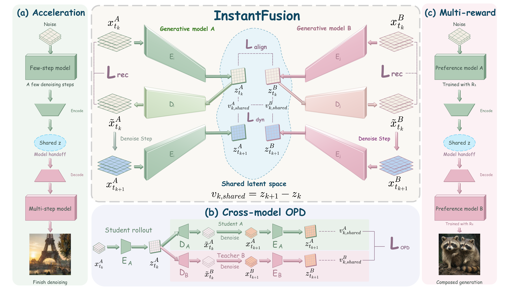
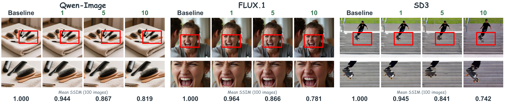
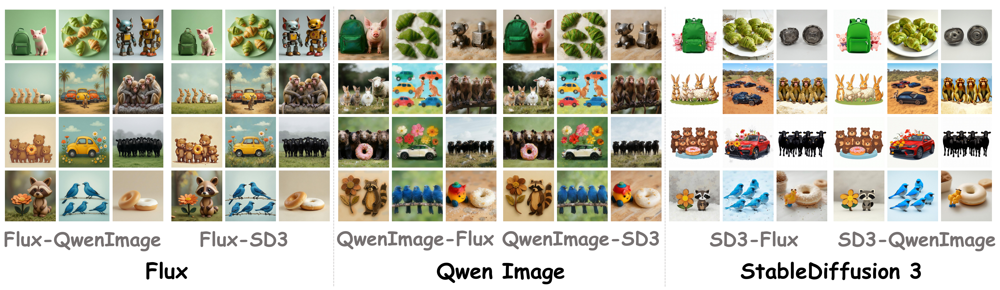

# InstantFusion

<p align="center">
  <strong>Composing diffusion models through a shared latent space</strong>
</p>

<p align="center">
  <a href="https://github.com/InternLM/InstantFusion"></a>
  
  
  
  
</p>

<p align="center">
  
</p>

<p align="center"><a href="fig/method.pdf">View the full-resolution method figure (PDF)</a></p>

## Overview

InstantFusion brings diffusion models into a shared latent space so their denoising trajectories can be aligned and composed. The current implementation uses **SD3** and **Qwen-Image** as its two models:

1. **Latent alignment encoder (LAE):** sigma-conditioned encoders and decoders map both models' latents into a shared space. Training combines reconstruction, cross-reconstruction, latent alignment, and denoising-velocity alignment.
2. **Cross-model OPD:** with Qwen-Image and the LAE frozen, an SD3 LoRA learns from Qwen-Image at selected denoising steps while retaining an SD3 reference objective.

The method figure also illustrates model handoff for acceleration and composition. This repository includes **LAE and OPD training** and **LAE-based model handoff inference**. The current inference entry point does not load the trained OPD LoRA yet.

## Visual results

### LAE reconstruction quality

The examples below compare the baseline with the LAE reconstruction results for Qwen-Image, FLUX.1, and SD3. The figure also reports mean SSIM over 100 images for each model.

<p align="center">
  <a href="fig/reconstruct.pdf"></a>
</p>

[Open the reconstruction figure as a PDF](fig/reconstruct.pdf) for a closer view.

### Cross-model denoising handoff

These examples show the results of switching models and continuing denoising with the second model. The figure includes model pairings beyond the SD3/Qwen-Image inference implementation currently available in this repository.

<p align="center">
  <a href="fig/trans.pdf"></a>
</p>

[Open the handoff figure as a PDF](fig/trans.pdf) to inspect the individual examples.

## Quick start

### 1. Set up the environment

```bash
git clone https://github.com/InternLM/InstantFusion.git
cd InstantFusion
conda create -n instantfusion python=3.10 -y
conda activate instantfusion
pip install -r requirements.txt
```

Use a compatible [DiffSynth-Studio](https://github.com/modelscope/DiffSynth-Studio) checkout in the same environment. The training scripts can import it through `DIFFSYNTH_ROOT`:

```bash
export DIFFSYNTH_ROOT=/path/to/DiffSynth-Studio
```

Provide a Qwen-Image model directory containing `transformer/`, `text_encoder/`, `vae/`, and `tokenizer/`, plus an SD3 single-file checkpoint. Model weights are not bundled with this repository.

### 2. Prepare the dataset

The training data is supplied locally and is not included in this repository:

```text
DATASET_ROOT/
└── train/
    ├── metadata.csv
    └── images/
        └── example.png
```

`metadata.csv` needs `file_name` and `text` columns. Image paths in `file_name` are relative to `DATASET_ROOT/train/`:

```csv
file_name,text
images/example.png,"A lighthouse above a quiet sea at sunrise"
```

### 3. Train the latent alignment encoder

`--prepare-prompt-cache` creates the required SD3 and Qwen-Image prompt embeddings before training. Training uses `./prompt_cache` unless `--prompt-cache` is set. The cache is runtime data and should stay outside version control.

```bash
bash scripts/train_lae.sh \
  --qwen-path /path/to/Qwen-Image \
  --sd3-path /path/to/sd3.safetensors \
  --dataset-path /path/to/DATASET_ROOT \
  --output-path ./outputs/lae \
  --prepare-prompt-cache \
  --size 512 --precision bf16 \
  --steps-per-epoch 1000 --epochs 5
```

The LAE checkpoint stores the shared-latent bridge parameters.

### 4. Train cross-model OPD

Use the LAE checkpoint from the previous stage. OPD trains an SD3 LoRA with Qwen-Image as the frozen teacher. By default it uses 20 sampling steps and supervises zero-based steps `1,2,4,8`. Change these with `--sampling-steps` and `--supervised-step-ids` when needed.

```bash
bash scripts/train_opd.sh \
  --qwen-path /path/to/Qwen-Image \
  --sd3-path /path/to/sd3.safetensors \
  --bridge-checkpoint /path/to/lae.ckpt \
  --dataset-path /path/to/DATASET_ROOT \
  --output-path ./outputs/opd \
  --size 512 --precision bf16 \
  --steps-per-epoch 1000 --epochs 5
```

OPD reuses the LAE prompt cache by default. If you use a different dataset for OPD, add `--prepare-prompt-cache` to populate embeddings for its prompts.

### 5. Run LAE-based inference

```bash
bash scripts/infer.sh \
  --qwen-path /path/to/Qwen-Image \
  --sd3-path /path/to/sd3.safetensors \
  --lae-checkpoint /path/to/lae.ckpt \
  --prompt "A lighthouse above a quiet sea at sunrise" \
  --output-dir ./outputs/inference
```

Inference defaults to 512 × 512 images, 50 steps, seed 42, and an adaptive SD3-to-Qwen-Image handoff with threshold `0.12`. Use `--size 512x768`, `--steps`, or `--seed` to change common settings. Use `--direction qwen_to_sd3` for the reverse route, or `--switch-step N` for a fixed handoff. Missing prompt embeddings are prepared automatically under `<output-dir>/prompt_cache` unless `prompt_embedding_dir` is set in a JSON config.

### Advanced settings

The command-line interfaces expose paths and common controls. Put less frequently changed trainer or model settings in a JSON file and pass `--config path/to/config.json` to the relevant command above. JSON uses the Python setting names with underscores; model and dataset paths remain command-line arguments. For example, an OPD config can contain:

```json
{
  "learning_rate": 0.00001,
  "lora_rank": 64,
  "reference_weight": 0.1
}
```

To reuse the training prompt cache during inference, an inference config can contain:

```json
{
  "prompt_embedding_dir": "./prompt_cache",
  "sd3_cfg": 4.0,
  "qwen_cfg": 4.0
}
```

Explicit command-line options take precedence over JSON settings. Training commands also accept the previous underscore-style option names, though `--help` displays the shorter hyphen-style names. Run `bash scripts/train_lae.sh --help`, `bash scripts/train_opd.sh --help`, or `bash scripts/infer.sh --help` for the compact option lists.

## Repository layout

```text
fig/                     Method and result figures (PNG and source PDF)
scripts/train_lae.sh     LAE training entry point
scripts/train_opd.sh     OPD training entry point
scripts/infer.sh         LAE-based inference entry point
src/instantfusion/       Bridge, model-loading, cache, training, and inference modules
```

## Citation

The paper link and BibTeX entry will be added when the paper is available.
